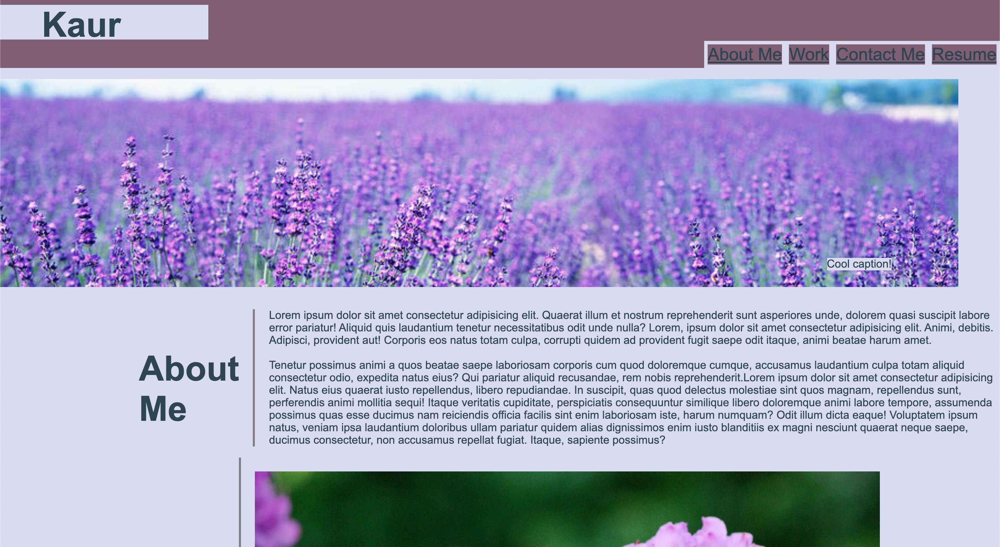
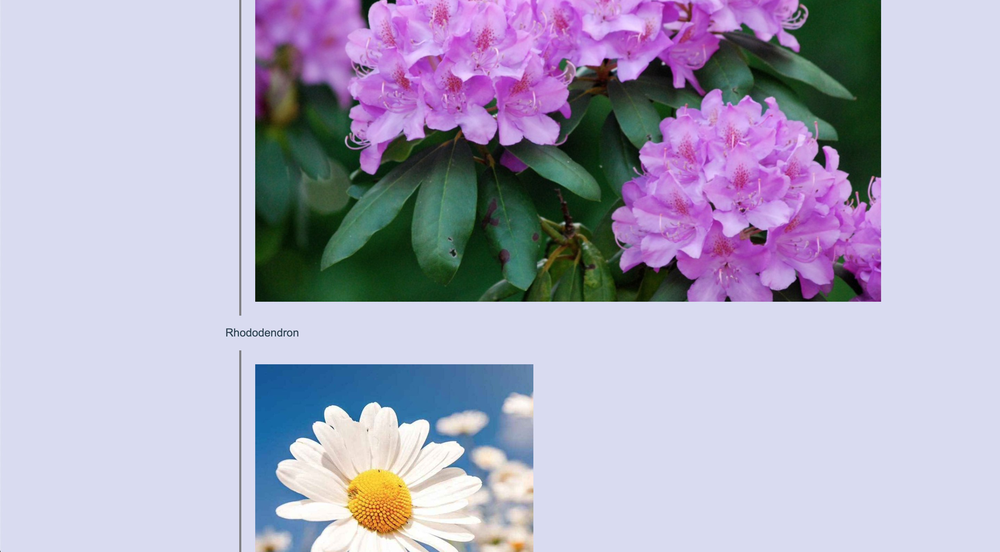
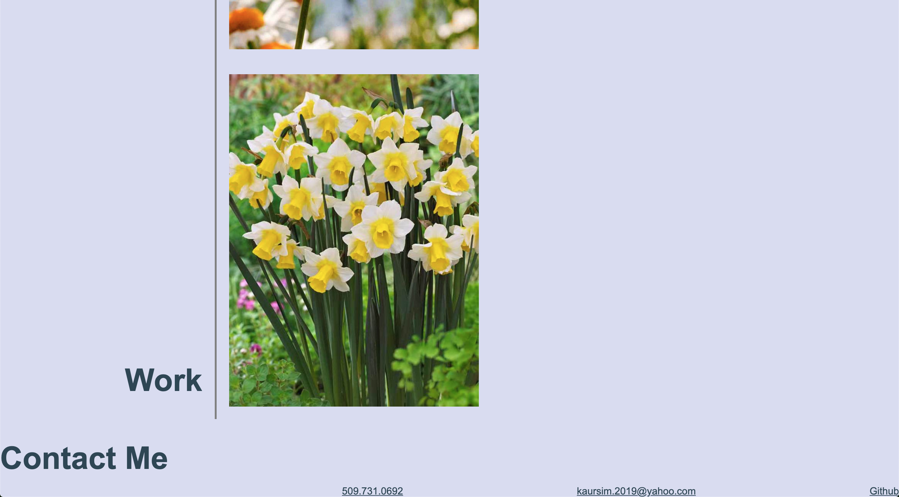

# Professional-Portfolio

In this assignment we were tasked with creating a full fledged website using our knowledge of CSS and HTML from the past week. 

I first pulled all the informations I need from the repo that I created into terminal and opened it in VS Code. From there I created an HTML and CSS file and linked them. After this I was able to start building the framework of my website in HTML. Once that was done I went to CSS and took care of the styling aspects. These aspects included styling my headers, adding hover elements, and aligning everything so it sits properly on the screen

After I was done I pushed everything into my github after adding and committing all the changes. Here are my URLS 
https://github.com/kaursim000/Professional-Portfolio
https://kaursim000.github.io/Professional-Portfolio/

